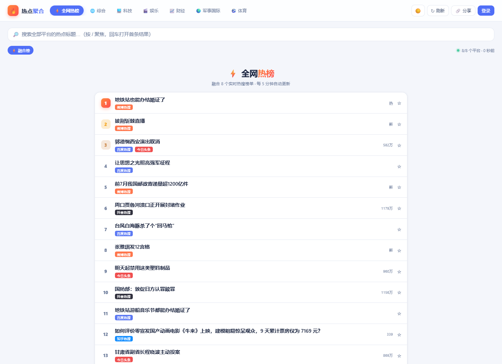
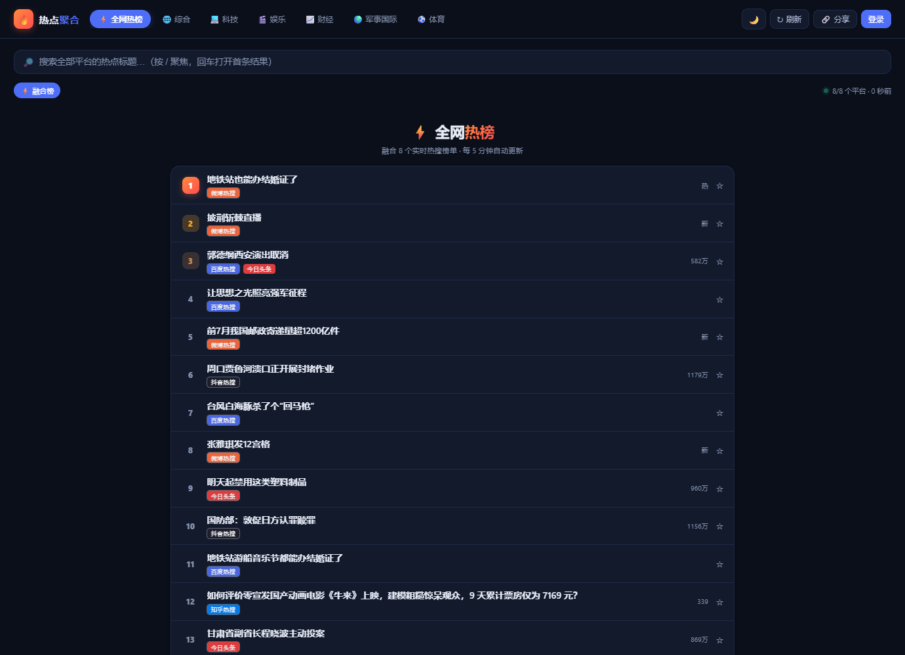

# 新闻汇总

自己用的热搜聚合小站。平时想知道"现在大家在关注什么"，要开微博开百度开知乎挨个看，烦，就写了个东西把四十多个平台的热榜攒到一个页面里。

打开默认是一张「全网热榜」：把微博、百度、抖音、头条、知乎、B站、贴吧的实时榜单按热度加权合成一张总榜，同一条新闻上了好几个榜会自动合并，标签上能看到它都上了哪几家。想看单个平台就点下面的分类慢慢刷。

| | |
|---|---|
|  |  |
|  |  |

在线体验（Render 免费层，偶尔慢）：https://hotnews-top.onrender.com

有问题找我：QQ 3674528093

## 都有些什么

- 40 来个平台，综合 / 科技 / 娱乐 / 财经 / 军事国际 / 体育六个分类，贴吧热议、掘金、开源中国、钛媒体这些是后来加的
- 亮暗两个主题，跟系统走，也能手动切
- 自带一张默认背景图（半透明垫底），也可以点右上角 🖼️ 换成自己的图片文件夹（比如收藏的剧照），透明度随便调。图片只存在你浏览器本地，不会上传
- 全局搜索：在已经加载的榜单里搜关键词，按 `/` 直达搜索框
- 收藏和浏览历史，注册个账号就能用（可选功能，见下面部署说明）
- 抓取挂了不会给你看白板：每个源都有备选接口，实在不行就把 6 小时内的旧数据顶着用，标个「延迟」，不装没事

## 跑起来

**最省事，本地跑（Python）**

```bash
pip install -r requirements.txt
python app.py
```

浏览器开 http://127.0.0.1:5000 。Windows 直接双击 `start.bat` 也行。

**部署到 Cloudflare（推荐，免费）**

之前挂在 Render 上，免费实例一刻钟没人访问就睡死，再打开要等半分钟。后来把后端用 JS 重写了一遍搬到 Cloudflare Workers 上（Python 没法直接跑在 Workers 里），顺便用它的定时任务每 3 分钟把数据预热好，打开就是现成的，全球都快：

```bash
cd cloudflare
npm install
npx wrangler login
npm run setup
```

会自动建缓存、填配置、部署，最后给你一个 `*.workers.dev` 的地址。详细说明和踩坑记录在 [cloudflare/README.md](cloudflare/README.md) 和 [cloudflare/DEPLOY.md](cloudflare/DEPLOY.md)。

两个提醒（都是实测踩过的）：

1. `workers.dev` 这个域在国内直连不了（被 DNS 污染，海外正常）。要国内稳定访问，绑个自己的域名就好，Worker 设置里点两下的事
2. 账号收藏功能需要配一个免费的 D1 数据库，不配也不影响看新闻，只是登录按钮会提示未启用

**还想要 Render 的话**也能用，配置文件都在。休眠问题已经用 Cloudflare Worker 的定时任务顺手解决了（每 3 分钟 ping 它一下），不用再去注册什么保活网站。

## 接口

`/api/news/batch?category=综合` 拿一整个分类，`/api/news/weibo` 拿单个平台，`/api/health` 看各源状态，加 `refresh=1` 强制刷新。收藏和历史就是普通的 `/api/favorites`、`/api/history`，带 token 的增删查。Python 版和 Cloudflare 版的接口一模一样。

## 关于抓取

只读公开榜单页面，几分钟一次，不碰登录内容，也不存原文。有些站点反爬比较凶（虎嗅、36氪这类上过 WAF 的），挂了就挂了，页面上会如实标出来，不造假数据。有哪个源长期不可用，欢迎提 issue 或者 PR 加新的——`app.py` 里加一个 `_fetch_xxx` 函数注册一下就行，Python 和 JS 两边各写一份（`cloudflare/src/fetchers.js`），跑 `node cloudflare/test/fetchers.test.mjs` 能直接看成功率。

## License

MIT，随便用。
